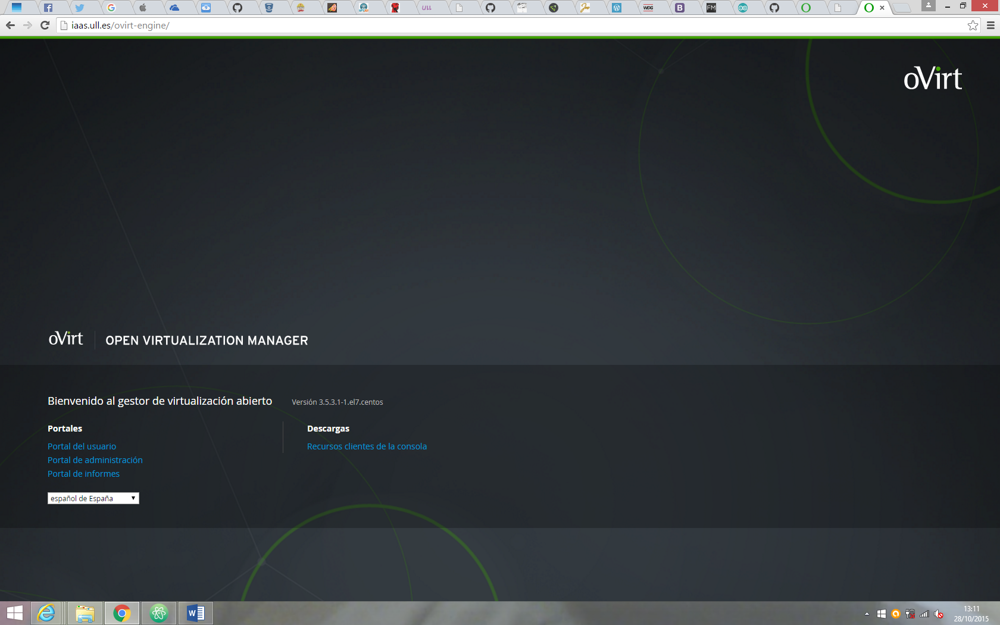
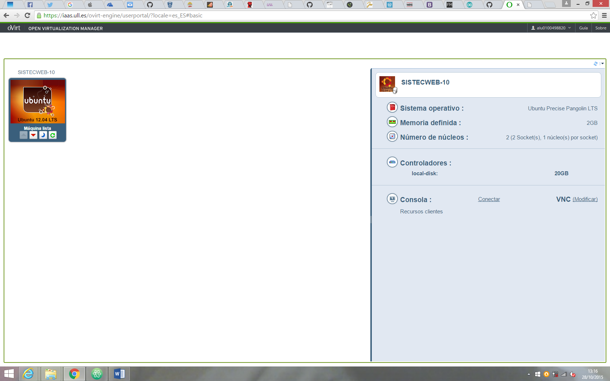
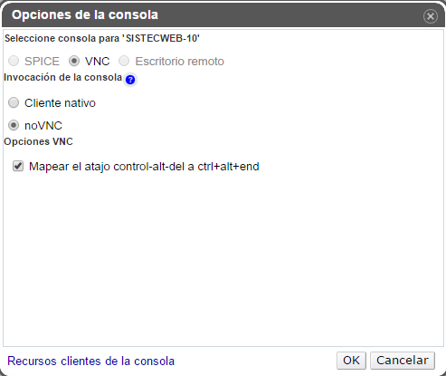
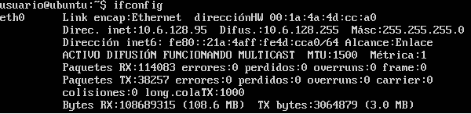
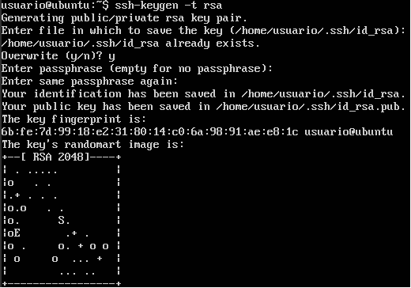
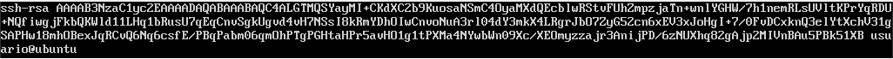

Lo primero que haremos es entrar en la página del IAAS ([iaas.ull.es](http://iaas.ull.es/ovirt-engine/))

A continuación accedemos con nuestro usuario y contraseaña:
 + user: alu0100·····
 + password: ·······

Una vez dentro comprobamos que tenemos instalado una maquina linux (ubuntu)

Lo que heremos a continuacion es configurar el con el visor VNC como muestra en la siguiente figura (recordar marcar la opción **noVNC**)

Una vez confirurado el apartado anterior y comprobado la version que tengamos de git con el comando:

    $ git --version

Pasamos a instalar el paquete de nodejs con el comando:

    $ sudo apt-get install nodejs

A continuación instalaremos npm para ello bastará con ejecutar:

    $ sudo apt-get install npm

Cuando estemos instalando tanto nodejs como npm nos pedirá unas credenciales que en principio seran **usuario/usuario** pero se nos forzará a cambiar la contraseña ante el primer login

### VPN ULL
#### Poniendo a Funcionar una Aplicación Web NodeJS

Primero averiguaremos la IP de la maquina para poder usar SSH, para ello ejecutamos el comando:

    $ ifconfig

y nos fijamos en ***eth0***, donde aparecera un apartado que pone ***Direc. inet: "IP" ***

Una vez tiendo claro cual es nuestra IP generamos nuestra clave privada para poder trabajar con los repositorios en **GitHub**, para ello ejecutamos el comando:

    $ ssh-keygen -t rsa

Lugo iremos al directorio ~/.ssh y copiamos la clave del directorio id_rsa.pub, la cual copiaremos en GitHub

Como no podemos usar la terminal del IAAS para copiar la contraseña nos vamos a una terminal de nuestro computador y accedemos mediante SSH
